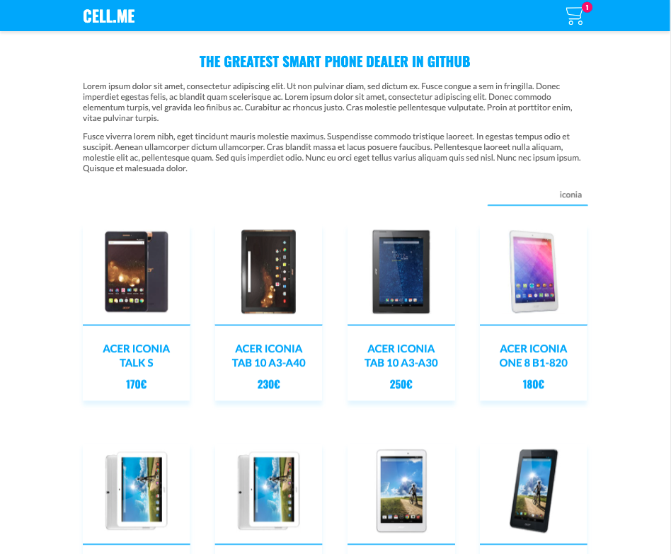

# cell.me
cell.me is a mock project created using React. The state is managed through Redux and Redux-Saga (for asynchronous actions). The state is persisted thanks to Redux-Persist. It's a SPA which manages routes through React Router. All components and utils are tested using React-Testing-Library. The app emphasizes code reusability and performance, making use of lazy load for better code splitting and dynamic loading.
  

## The requirements
The project is supposed to consist of two pages, a home page and a detail page. Along the app the user should be able to interact with the different products.
  
### Header
The Header is supposed to be visible accross all the pages. It should include a button to return to the home page and a cart where the user can see how many products he has added.  
  
  
  
When the cart is clicked, a dialog pops up, displaying the chosen items. It shows the total price for the amount of products added, the amount can be increased and reduced, and also the item can be removed from the cart.
   
  
  
### Home
The Home renders a list of smartphones which come from a call to an API. The API is only called the first time the user accesses the page, then it's persisted in the local storage, so subsequent renders won't trigger the call again.  
There's a search input at the top right corner, so that the devices can be filtered according to their brand and/or model. The filtering is done in real-time.  
  
For each phone there's a card with the device's brand, model, image and price (if available). If the card is clicked, the app navigates to the detail page.  
  
  
  
### Detail page
In this page we can see the breadcrumbs at the top left corner of the page, letting the user know his navigation path. Below, the details are divided into two columns, the left one where the image is shown, the right one with technical specifications and actions associated with the phone's purchase.  
  
When the page is accessed, a call to the API is fired requesting the item's details by sending its id, which is taken from the URL. Once the details are received, they're persisted in the local storage, so that if the user access this product's details again, it doesn't need to call the API.  
  
At the bottom of the page we can see the smartphone configuration options, from which the user can pick one of each category. If the item is added to the cart, a bubble will pop over the cart at the top of the page, rendering the number of items contained in it.
  
  
  

## Commands to run the app
After running `npm install`, the following commands will let interact with the application:  
* `npm start` sets the app up and running on localhost:3000, so you can check it out  
* `npm test` runs all the app tests  
* `npm build` generates an optimized build for production  
* `npm run lint` will check the app's code to spot format mistakes  
